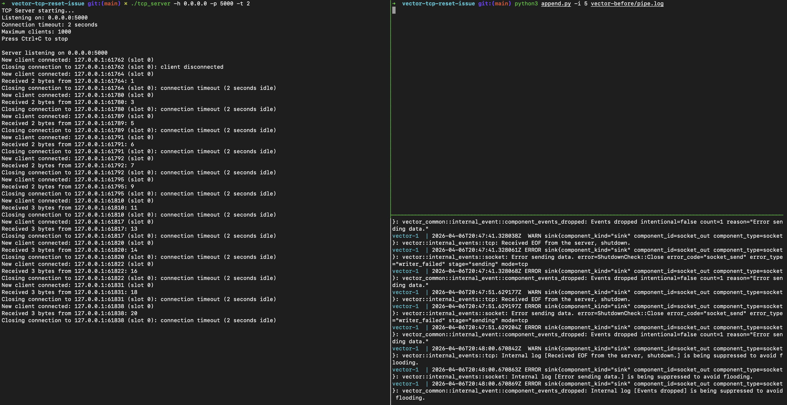
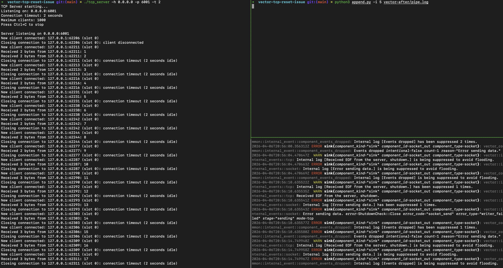

# Vector TCP Data Loss on Server Reset

This repository demonstrates how Vector encounters log loss when the server side of a TCP connection is reset.

## Demonstration

This repository implements a simple TCP server that outputs the state of TCP connections,
as well as the data sent on a given connection. The TCP server will timeout and reset
connections after a set time value.

For the demonstration, Vector is configured to read from the end of a log file
where consecutive numbers are being appended. If a number
is not seen or skipped in the output of the TCP server, it indicates the log was lost.

The following screenshot captures the demo running with the Vector docker image v0.54.0.



Log loss is clearly shown by the skipping of certain consecutive numbers.

The next screenshot captures the demo running with a branch that fixes the issue.



The numbers are now consecutive and no log loss occurs.

## Building

### Prerequisites
- GCC compiler
- POSIX-compatible system (Linux, macOS, Unix)
- Standard C library with socket support
- Docker Compose

### Build Steps

1. First build the tcp client and server applications.

```
make
```

## Usage

### Using Docker Compose

1. Run the TCP server to listen on port 6000 for all interfaces, closing TCP connections on a timeout of 2 seconds.

```
./tcp_server -h 0.0.0.0 -p 6000 -t 2
```

2. Run Vector using docker compose.

```
cd vector-before && docker compose up
```

3. Run the append.py script to start sending log lines every 5 seconds.

```
python3 append.py -i 5 vector-before/pipe.log
```

### Using Native Vector

If you want to test the branch that fixes the issue you can run vector natively.

1. Run the TCP server to listen on port 6001 for all interfaces, closing TCP connections on a timeout of 2 seconds.

```
./tcp_server -h 0.0.0.0 -p 6001 -t 2
```

2. Run Vector natively.

```
~/path/to/vector/target/release/vector -c vector-after/vector.toml
```

3. Run the append.py script to start sending log lines every 5 seconds.

```
python3 append.py -i 5 vector-after/pipe.log
```
